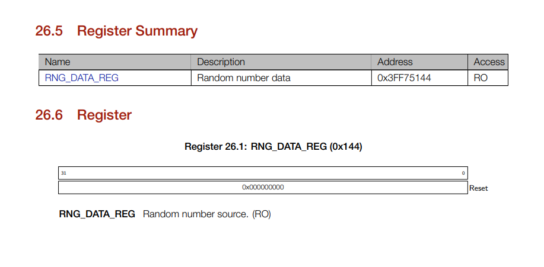

# Lecture 1: Lab Introduction & Memory Mapped Hardware 
In this lecture, we will look at Lab 1, and we will also investigate the hardware/software boundary.

### Arduino code
The technical content of this lecture is mainly around live coding demonstrations in the Arduino IDE (what you'll be using in labs). We will be using it to investigate pointers and manipulate the hardware registers of the device. The code examples that I follow can be found [[here](https://github.com/STFleming/EmSys_LabIntro_MemoryMappedHardware/tree/main/Arduino)]. _Note that they may differ slightly from what I code in the lecture_

# Lab Admin
### Lab Groups 
For the labs, you will need to arrange yourselves into groups of two or three. Once you have decided on the members of your group __one lab member__ should input the student IDs of each group member into the form found here [[form link](https://forms.office.com/Pages/ResponsePage.aspx?id=LrXKu76f1kOi859mxD3yaGURemXIkvJEi0OJyB0IdsxUNDNPUVFHWFdZSVFQMUhTTTNTRDRBSjBRNi4u)] by __Wednesday 03/02/2021__ before __15:00__ . After this time, any people left over will be randomly allocated into groups.

### Lab machine access
The EmSys labs will be using the Linux machines located in the Foundry. You should have received an email containing your login details to access these machines. __If you have not received your login details, please contact me__.

### Connecting to the Lab and Enviroment Setup 
Follow the guide [[here](https://github.com/STFleming/EmSys_labSetup)] on how to connect to the lab via ssh and setup your environment. 

### Lab1 repository
The Lab1 repository is available [[here](https://github.com/STFleming/EmSys_Lab1)]. Here you will find information on the lab tasks, the required structure of your logbook repository, and videos explaining how to use the tools.

### During the labs
The EmSys labs will use Discord to manage communications between groups and demonstrators. On Discord, there will be a voice channel will for each group. Each group member connects to their appropriate channel where they will be able to share their screens and complete the lab together. If you have a question, request assistance in the ``raise-your-hand`` channel, stating what room you are in; a demonstrator will come and join your voice channel and help you once they are free. Remember:  keep an eye on the ``lab-announcements`` channel for lab wide announcements.

# Memory mapped hardware

In the lecture, I discussed the concept of mapping hardware into the address space of the system. By providing memory addresses for hardware we create an incredibly powerful and convenient abstraction for manipulating hardware from software. Every microprocessor will have memory; memory needs addresses, so using the same convention our custom hardware component can be compatible with all systems. 

Now, dealing with memory is dangerous. For instance, it's easy to write into memory regions you shouldn't accidentally, or you can forget to free it when you've finished using it. For these reasons, and many others, most languages perform memory management for the programmer. However, C does not. In C, we have the idea of a pointer -- a variable that instead of storing a value, stores a memory location. The pointers provided by C allow us to manipulate memory directly, and thus we can also interact directly with memory-mapped hardware. It's this reason that almost all drivers and deep parts of operating systems use the C language, and one of the reasons it is still a prevalent language since its development in 1972. 

In this document, we will look at pointers and interfacing with our TinyPico devices. Specifically, we will investigate:
* C Pointers -- looking at examples in the Arduino IDE
* The address map of our TinyPico
* How we can read and write to hardware registers and interact with memory-mapped hardware
* Bit manipulation operations in C

### Pointers
Look at the following arduino sketch

```C

int a; // a variable
int *ptr_a; // a variable that is a pointer

void setup() {
        Serial.begin(115200);
        Serial.print("\n\n");

        a = 10;
        ptr_a = &a; // ptr is pointing to the address of a

        Serial.print("Variable a has value:");
        Serial.println(a);

        Serial.print("and lives at address 0x");
        Serial.println((unsigned int)ptr_a, HEX);
}
```
[[This code can be found here](Arduino/BasicPointer)]

In this sketch we have a few variables, ``a`` which is assigned the value ``10`` and ``ptr_a`` which is a pointer variable. To declare a pointer we need to use the ``*`` operator, we place this after the type in the variable declaration to make our variable a pointer of that type. In this example, we have ``int * ptr_a;`` which says that ``ptr_a`` is a pointer to an integer type. We can make pointers to any type we wish, for instance, ``float * ptr_b;`` would make a pointer to a floating point variable.  

In order to effectively use a pointer, we need to have the ability to lookup where items are stored in memory. To do this we can use the ``&`` operator. In the example above, we have the line ``ptr_a = &a``, what this effectively says is,_"get the address of where variable ``a`` is stored, and store that address in ``ptr_a``"_.

Let's compile the code and see what the output looks like on the ``Serial`` monitor in Arduino.

```
Variable a has value:10
and lives at address 0x3FFC00C8
```

We can see here that the value of the variable was printed along with it's address ``0x3FFC00C8`` in Hexadecimal. We can now dive into the [[ESP32 Technical Reference Manual (TRM)](https://www.espressif.com/sites/default/files/documentation/esp32_technical_reference_manual_en.pdf)] to find out what this address region corresponds to in the device we will be working with on this course, the ESP32 System-on-Chip (SoC).

On Page 27 of the TRM we can see the following chart.


What we can see from the chart that our variable ``a`` which has address ``0x3FFC00C8`` lies in the region ``0x3FF80000 - 0x3FFFFFFF`` which maps into the ``512KB Embedded Memory`` of our SoC. Scrolling down a bit further we can find a further breakdown of the address space for the embedded memory.


From this we can see that our address ``0x3FFC00C8`` is in the region ``0x3FFAE0000 - 0x3FFDFFFF`` which is the ``Internal SRAM 2``, a very fast memory quite close to the CPU in our SoC.

### Derefrencing a pointer

We can also manipulate the data stored at the address a pointer point to. To use pointers in this way we need to do something called derefrencing.

Take the following example:

```C
int a; // a variable
int *ptr_a; // a variable that is a pointer

void setup() {
        Serial.begin(115200);
        Serial.print("\n\n");

        a = 10;
        ptr_a = &a; // ptr is pointing to the address of a

        *ptr_a = 40;

        Serial.print("Dereferencing a = ");
        Serial.println(*ptr_a);
}
```

This example is almost the same as the previous one, again we have ``a`` and ``ptr_a``. However, now we also have some other operations again using the ``*`` operator.

In the line ``*ptr_a = 40;`` we are using the ``*`` operator to assign the value 40 __into the location that the pointer is pointing to__.
In this case ``ptr_a`` is pointing at the memory location of variable ``a``, so the line of code ``*ptr_a = 40;`` overwrites the ``10`` already stored in ``a`` with ``40``. Essentially what is happening here, is the compiler is issuing a load to get the address stored in ``ptr_a``, it is then immediately using the address returned to perform a store operation with the literal value ``40``. 

A similar story can be said for dereferencing a pointer for reading purposes. In the line ``Serial.print(*ptr_a);`` the ``*ptr_a`` is telling the compiler, load the value stored in ``ptr_a`` then immediately use that returned value to perform another load, getting the contents of the ``a`` variable. 

This dual use of the ``*`` operator in the C syntax can be a source of confusion for people new to pointers, essentially:
* ``*`` is used to:
  * __declare__ a pointer type, e.g. ``int * ptr_a;`` 
  * __dereference__ a pointer, either for reading purposes ``Serial.print(*ptr_a)``, or for writing ``*ptr_a = 40``.
* ``&`` is used to get the address of a variable or object

### Double pointer
We can also go further and make pointers to pointers.

```C
int a; // a variable
int *ptr_a; // a variable that is a pointer
int **ptr_ptr_a;
int ***ptr_ptr_ptr_a;

void setup() {
        Serial.begin(115200);
        Serial.print("\n\n");


        a = 10;
        ptr_a = &a; // ptr is pointing to the address of a
        ptr_ptr_a = &ptr_a; // a pointer to a pointer of a
        ptr_ptr_ptr_a = &ptr_ptr_a;

        Serial.print("Variable a has value:");
        Serial.println(a);

        Serial.print("and lives at address 0x");
        Serial.println((unsigned int)ptr_a, HEX);

        Serial.print("Double dereference: ");
        Serial.println(***ptr_ptr_ptr_a);
}

```

In the example above, we have ``ptr_ptr_ptr_a``, which is pointing at the address of ``ptr_ptr_a``, which is pointing at the address of ``ptr_a``, which is pointing at the address of ``a``.
Again all the derefrencing operations above work in these cases also. However, notice the number of ``*``s used increases with the levels of indirection, in both derefrencing the pointer and in declaring it.

Compiling and running this gives the following serial console output:

```
Variable a has value:10
and lives at address 0x3FFC00D0
Double dereference: 10
```

### Pointer types

_Why do we have pointer types? Why dont we just have one address type?_

In the previous example we declared an integer type pointer, ``int * ptr_a;``. But why did we do this, all of our addresses in our system are 32-bit. Why didn't we just declare some sort of 32-bit value to store the address location.

__The reason is because pointers take into account the size of the data item that they are pointing to.__ Different types in the system consume a different number of bytes, consider the following code:

```C
void setup() {
        Serial.begin(115200);
        Serial.print("\n\n");
  
        Serial.print("datatype      size\n");
        Serial.print("int           "); Serial.println(sizeof(int));
        Serial.print("float         "); Serial.println(sizeof(float));
        Serial.print("char          "); Serial.println(sizeof(char));
        Serial.print("uint16_t      "); Serial.println(sizeof(uint16_t));
        Serial.print("bool          "); Serial.println(sizeof(bool));
}
```
This is printing out the size of different datatypes in number of bytes. The ``sizeof()`` function is used to return in bytes the type of the input argument for that system. Running this gives us the following serial console output:

```
 datatype      size
 int           4
 float         4
 char          1
 uint16_t      2
 bool          1
```

What we can see from the output that different datatypes consume different amounts of bytes in memory. In most modern systems memory is byte-addressable, meaning that we can address one byte of memory at a time in hardware. For this reason our smallest datatypes, ``bool`` and ``char`` consume one byte of data. The ``bool`` type is quite wasteful, it can be represented by a single bit but because memory hardware is byte-addressable, requires a whole byte to be stored.  

We can perform arithmetic on pointers, and the compiler will take into account the size of the item when we are manipulating the addresses that the pointer points at.

For instance, consider the following arduino code:

```C 
int a;
int* ptr_a;

void setup() {
        Serial.begin(115200);
        Serial.print("\n\n");
        
        a = 10;
        ptr_a = &a; // ptr is pointing to the address of a
        
        Serial.print("Variable a has value:");
        Serial.println(a);
        Serial.print("and lives at address 0x");       
        Serial.println((unsigned int)ptr_a, HEX);
        
        ptr_a = ptr_a + 1;
        Serial.print("ptr_a now points to address 0x");
        Serial.println((unsigned int)ptr_a, HEX);
}
```
Which produces the following serial output:

```
Variable a has value:10
and lives at address 0x3FFC00C8
ptr_a now points to address 0x3FFC00CC
```

In this example, the pointer ``ptr_a`` is of type ``int *``, meaning it is pointing to an integer which is 4 bytes in size. When we perform arithmetic on the pointer with the line ``ptr_a = ptr_a + 1``, what we can see if that the address stored in ``ptr_a`` has changed from ``0x3FFC00C8`` to ``0x3FFC00CC``. Now looking at ``0x3FFC00CC - 0x3FFC00C8 = 4`` the size of an integer.

Next consider the following code:

```C
bool a; // a variable
bool *ptr_a; // a variable that is a pointer

void setup() {
        Serial.begin(115200);
        Serial.print("\n\n");

        a = true;
        ptr_a = &a; // ptr is pointing to the address of a

        Serial.print("Variable a has value:");
        Serial.println(a);
        Serial.print("and lives at address 0x");
        Serial.println((unsigned int)ptr_a, HEX);      

        ptr_a = ptr_a + 1;
        Serial.print("ptr_a now points to address 0x");
        Serial.println((unsigned int)ptr_a, HEX); 
}
```
In this example the variable ``a`` and ``ptr_a`` have been changed from an ``int`` and ``int *`` type to a ``bool`` and ``bool *`` type. When we execute the code we get the following serial console output:

```
Variable a has value:1
and lives at address 0x3FFC00C8
ptr_a now points to address 0x3FFC00C9
```
What we can see now is that the address only increased by one byte, ``0x3FFC00C9 - 0x3FFC00C8 = 1`` the size of a ``bool`` variable on our system. 

Where this is really useful is with arrays.

### Arrays in C

An array in C essentially blocks out a chunk of contiguous (right next to each other) memory that can be used. Take the example below:

```C
int a[8] = {42, 43, 44, 45, 46, 47, 48, 49}; // an array 

void setup() {
        Serial.begin(115200);
        Serial.print("\n\n");

        for(int i=0; i<8; i++) {
            Serial.print("[0x");
            Serial.print((unsigned int)&a[i],HEX);
            Serial.print("] = ");
            Serial.println(a[i]);
        }

}
```

This declares an integer array ``int a[8]`` and initialises it with the values ``42,43,44,45,46,47,48,49``. Using a for loop and our ``&`` operator discussed earlier we can print out the memory address for each element of our array and the value stored at that location. Running the code produces the following serial console output:

```
[0x3FFBEBE8] = 42
[0x3FFBEBEC] = 43
[0x3FFBEBF0] = 44
[0x3FFBEBF4] = 45
[0x3FFBEBF8] = 46
[0x3FFBEBFC] = 47
[0x3FFBEC00] = 48
[0x3FFBEC04] = 49
```

What we can notice is that for each element of our array the address is increasing by the type of the array, in this case an ``int`` which is 4 bytes.

In the previous section we looked at how pointer arithmetic took into consideration the type of the pointer. If we add 1 to an ``int *`` it will increase the address by 4 Bytes. This means that we can use it to iterate over the array. For example, we can change the code above with:

```C
int a[8] = {42, 43, 44, 45, 46, 47, 48, 49}; // an array
int *ptr_a; // a variable that is a pointer

void setup() {
        Serial.begin(115200);
        Serial.print("\n\n");

        ptr_a = &a[0]; // points to the first element of the array 
        for(int i=0; i<8; i++) {
                Serial.print("[0x");
                Serial.print((unsigned int)(ptr_a), HEX);
                Serial.print("] = ");
                Serial.println(*ptr_a);
                ptr_a = ptr_a + 1;
        }
}
```

Where we have replaced reading the array ``a[i]`` instead with pointer arithmetic on ``ptr_a``, and we would get exactly the same output on the serial console. 

Arrays and pointers are deeply linked, in fact the C standard defines the array syntax as:

```
             a[b] == *(a + b)
```

Which means that ``a[b]`` is equal to the pointer ``a`` where we have added ``b`` and dereferenced it all ``*(a + b)``. Now, since addition is commutative, we can actually do this monstrosity and it will compile and work:

```C
int a[8] = {42, 43, 44, 45, 46, 47, 48, 49}; // an array

void setup() {
        Serial.begin(115200);
        Serial.print("\n\n");

        // a[b] == *(a + b)
        Serial.println(0[a]); 
        Serial.println(1[a]);
        Serial.println(2[a]);
        Serial.println(3[a]); // 3[a] == *(3 + a) == *(a + 3)
        Serial.println(4[a]);
        Serial.println(5[a]);

}
```

Which will run and produce the serial output:

```
42
43
44
45
46
47
```

``5[a]`` to me looks like it shouldn't compile, but hey... 

### Pointer casting

Another useful feature of pointers is that we can cast them into different types to slice up memory in different ways. I wont go into the details of it here, but there is an example in this repo [[here](Arduino/Casting/Casting.ino)] that demonstrates this.

## Memory-mapped hardware

Remember at the start I said that we would be using memory addresses to interact with hardware. Well that is why pointers are so handy, we can assign them memory addresses, and then derefrence them to read or write values. If a block of hardware in our system has a memory-mapped address then we can construct a pointer for it and write directly into our hardware units and manipulate them.

Let's look at a simple hardware block, the true random number generator on the ESP32 chip, which is described on page 594 of the [[Technical Reference Manual (TRM)](https://www.espressif.com/sites/default/files/documentation/esp32_technical_reference_manual_en.pdf)]. 


This is a true random number generator that uses samples noise from the ADCs periodically to increase entropy. This unit is memory-mapped in the system and has a very simple interface:



The register for the hardware random number generator is mapped to address ``0x3FF75144`` and it is a ``RO` (read only) register, any writes to it are just thrown away. Let's write some simple code to periodically read from this register, and then we can use the Arduino serial plotter to plot it. 

```C
unsigned int *hardware_rng; // a variable that is a pointer

void setup() {
        Serial.begin(115200);
        Serial.print("\n\n");

        hardware_rng = (unsigned int*)(0x3FF75144);
        
}

void loop() {
    delay(1);
    Serial.println(*hardware_rng);
}  
```
In this code we are defining a pointer ``unsigned int *hardware_rng;``, which we are assigning a value ``(unsigned int*)(0x3FF75144)``, the address of our hardware random number generator we got from the datasheet. The ``(unsigned int*)`` is called a cast, and we are using it to make the literal ``0x3FF75144`` the same type as our pointer. 

In the ``loop()`` of our arduino sketch we can then read our true hardware number generator by simply derefrencing the pointer we just defined. We can then pass that over the serial channel where we can plot it with the Arduino plotter (Tools->serial plotter), to get the following output:


And that's it. We have used a pointer to interact with memory mapped hardware.


